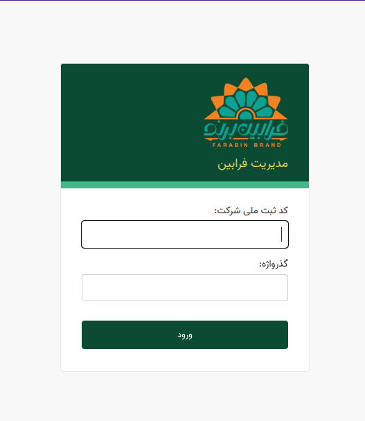
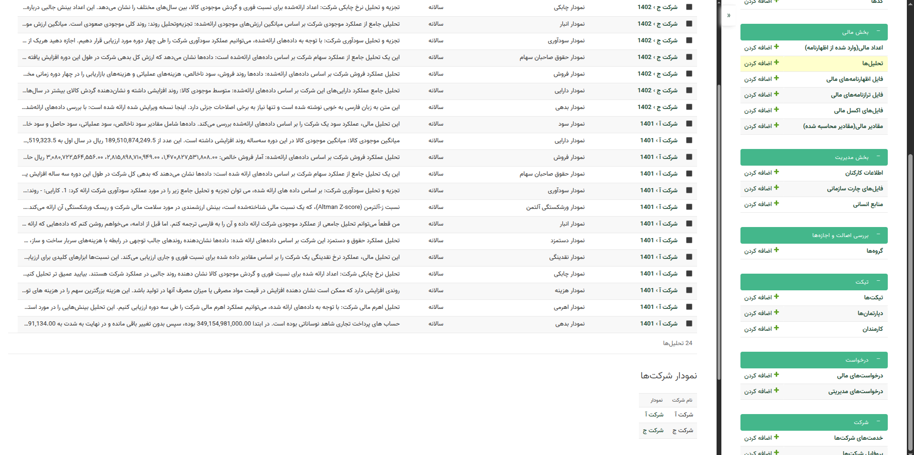

# برای استفاده از پنل مدیریتی که در اختیار شما قرار گرفته است ابتدا باید درخواست خود را برای ثبت شدن با شماره و رمز عبور خود ارائه نمایید و سپس میتواند با استفاده از صفحه ورود از پنل خود استفاده کنید

> کد ثبت ملی شرکت همان کد ملی شما به اضافه تکرار رقم اخر آن میباشد. برای مثال:
> کد ملی :۱۲۳۴۵۶۷۸۹۰
> کد پرسنلی شما: ۱۲۳۴۵۶۷۸۹۰۰

## پس از ورود به پنل خود با توجه به جایگاه و قابلیت‌های شما میتوانید از بخش‌های مختلف برای مدیریت و تنظیمات خود استفاده کنید

### بخش مالی

امکانات و ویژگی‌های بخش مالی به صورت ذیل میباشند.

#### 1.فایل‌های بارگذاری شده توسط شرکت‌ها

در این بخش شما میتوانید با استفاده از گزینه‌های `فایل اظهارنامه‌های مالی` و یا `فایل ترازنامه‌های مالی` به مستندات بارگزاری شده شرکت‌ها دسترسی داشته و در صورت لزوم تغییراتی را با توجه به سطح دسترسی خود بر روی آن‌ها اعمال کنید.

>[!NOTE]
> میتوانید با انتخاب هر یک از سطر‌های موجود به اطلاعاتی نظیر نام شرکت‌ها، سال بارگزاری اسناد، فایل آنها و همچنین وضعیت ‌آنها دسترسی پیدا کنید.

#### 2. استخراج داده‌های مالی از اسناد بارگزاری شده کاربران

با مراجعه به بخش `اعداد مالی(وارد شده از اظهارنامه)` میتوانید دسترسی به اطلاعاتی که از قبل ثبت شده‌اند داشته باشید. همچنین میتوانید با انتخاب گزینه اضافه کردن عدد مالی میتوانید داده‌های جدیدی را بر اساس اسناد هر شرکتی بارگزاری نمایید. که شامل `شرکت`، `سال،` `ماه` و `الباقی مقادیر مالی` ارائه شده توسط شرکت‌ها میباشد.

>[!NOTE]
> چنانچه که در حال وارد کردن اطلاعات از اظهارنامه هستید لازم است که گزینه آیا اظهارنامه است؟ را انتخاب نمایید.

#### 3. مشاهده مقادیر محاسبه شده بر اساس داده‌های ورودی

پس از ورود اطلاعات مالی توسط شما سامانه به صورت خودکار میتواند مقادیری را بر اساس نسبت‌های مشخص شده محاسبه کند که از طریق بخش `مقادیر مالی (مقادیر محسابه شده)` مشاهده کنید.

> [!WARNING]
> در صورتی که مقدار مورد نظر شما به صورت خودکار تولید نشد لازم است که یک بار دیگر به بخش اعداد مالی مراجعه کنید و تنها مقدار مورد نظر را باز کرده و یک بار دیگر ذخیره نمایید.
>
> در هر یک از مقادیر ایجاد شده گزینه‌ای به نام `انتشار برای کاربر` وجود دارد که در صورتی که آن را انتخاب ننمایید داده‌های محاسبه شده برای کاربران قابل مشاهده نخواهد بود.

#### 4. مشاهده نمودار و تحلیل‌های مالی

پس از اینکه مقادیر مالی کاربران به حالت `انتشار برای کاربر` درآیند سامانه به صورت خودکار و با استفاده از هوش مصنوعی تحلیل‌هایی را متناسب با اعداد و ارقام مالی شرکت‌ها تولید میکند و در اختیار شما برای بازرسی بیشتر قرار میدهد. همچنین این بخش نیز دارای گزینه‌ی `انتشار برای کاربر` است که در صورتی که ‌آن را انتخاب کنید تحلیل‌های ایجاد شده برای کاربر در دسترس قرار خواهند گرفت.

در انتهای همه تحلیل‌های ایجاد شده که قابل ویرایش را نیز دارا هستند، نمودار‌های متناظر با اطلاعات مالی شرکت‌ها نیز در دسترس شما قرار خواهند داشت که میتوانید با مشاهده آنها در صورت لزوم تغییراتی را در تحلیل‌های ایجاد شده اعمال کنید.

