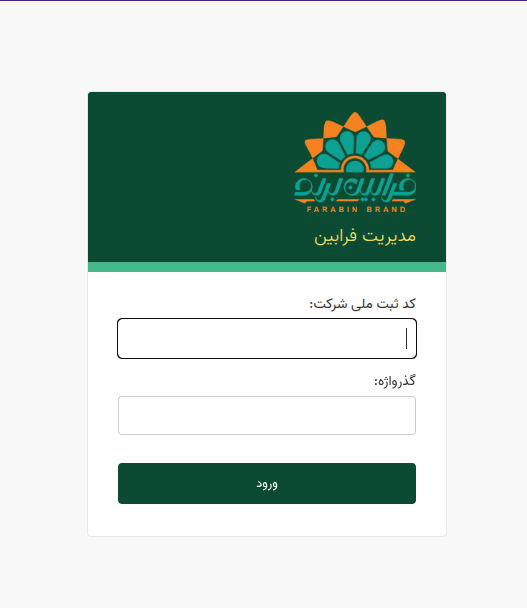

# برای استفاده از پنل مدیریتی که در اختیار شما قرار گرفته است ابتدا باید درخواست خود را برای ثبت شدن با شماره و رمز عبور خود ارائه نمایید و سپس میتواند با استفاده از صفحه ورود از پنل خود استفاده کنید
> کد ثبت ملی شرکت همان کد ملی شما به اضافه تکرار رقم اخر آن میباشد. برای مثال: 
> کد ملی :۱۲۳۴۵۶۷۸۹۰
> کد پرسنلی شما: ۱۲۳۴۵۶۷۸۹۰۰

## پس از ورود به پنل خود با توجه به جایگاه و قابلیت‌های شما میتوانید از بخش‌های مختلف برای مدیریت و تنظیمات خود استفاده کنید

